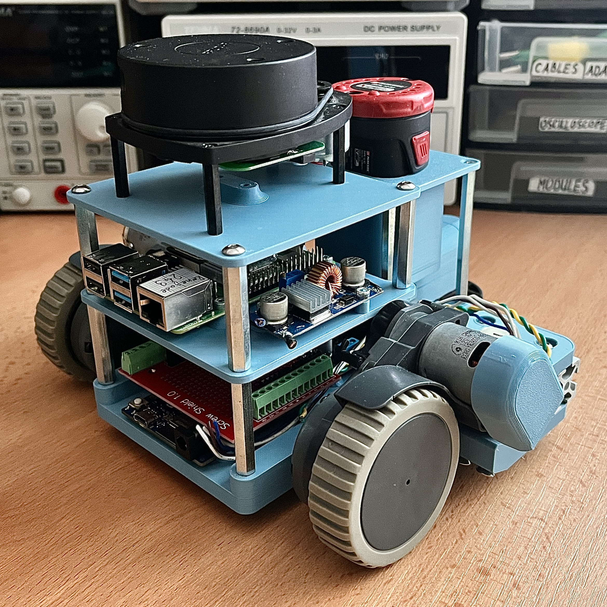

# PlatypusBot
You’ve heard of the TurtleBot, but get ready to meet the PlatypusBot! The idea is making a TurtleBot style robot but by using any means necessary, in my case, parts from a broken vacuum cleaner!

## Plan
Robot vacuum cleaners have become extremely popular and they can be found for not much money, especially if there is something wrong with them! The thing that most oftenly dies on them is the battery, so the rest of the electronics are solid. If you think about it, these little robots that cost from a 100$ and upward are pretty good little robots. They are able to navigate houses and apartments based only on a bump sensor in the front, with the higher end models haiving fancy things like LIDAR and even robot arms! This all means that you can find them extremely cheap if the battery is gone. I found mine for 10$ looking brand new except the battery.

This means that we have a pretty good source of cheap robotics parts that we can use to recreate the funcionality of the TurtleBot. This will be a WIP where I will through updates and videos go from making the basic robot construction, to adding ROS2, to doing things like SLAM and so on. Below you can see the videos covering the project in more detail, you can also find a lot of details on element14 community which will also be linked under each video!

## Video 1 - Making the PlatypusBot
In the first video I concentrate on making the most basic construction that we will use to build upon our robot and ugprade it further. The goal for this video was to dissassemble the broken robot vacuum cleaner and pull out all of the useful parts, and then make that into a wirelessly controlled robotic platform. Here are the links for the video and the blog.

### VIDEO[
https://youtu.be/1JZ3xP942HA?si=DFT3S7q6ZO4tUtq8

### BLOG
https://community.element14.com/challenges-projects/element14-presents/project-videos/w/documents/71934/platypusbot---scavenging-for-robotics-parts----episode-671?ICID=HP-671-PlatypusBot-Scavenging-for-Robotics-Parts-JUN25-WF4102410

After a quick dissassembly, here are all of the parts that I pulled that I plan to save for my projects. Just to repeat, the robot vacuum I found was 10$ because of the bad battery, besides that, everything else looked flawless.

From this pile of parts, we are interested in three parts for now, these are the 2 drive wheel assemblies and the small swivel wheel. The drive wheel assemblies are really good since they already include everything we need, we have a motor, an encoder, a gearbox and a small plastic and rubber wheel on the end. Perfect for making a small robot. There are multiple versions of the TurtleBot, my plan was to go after the classsical one that is called the Burger, so this is how I imagined the design for it.

If you're interested in more details about the design, I suggest you check the video where I went into detail on how to design around weird shaped parts. For now, I went with an Arduino Uno WiFi as the brains of the robot, just because it has WiFi and with the simple L298N motor driver. I've written a script in Python that lets me control the robot using a joystick where commands are sent over WiFi usign UDP. Check the video out for testing, and here is how the finished robot turned out!

## Future Plans
This Readme will be updated as the project progresses and as I complete new videos. Plan for the next stage is adding a Raspbbery Pi SBC as the main brain of the robot. The Raspberry will run ROS2 and we will utilize the encoders that we already have on the drive wheel assemblies. After that, we will go into more complex electronics and algorithms!

